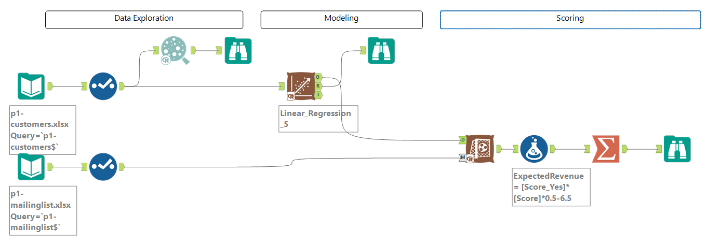
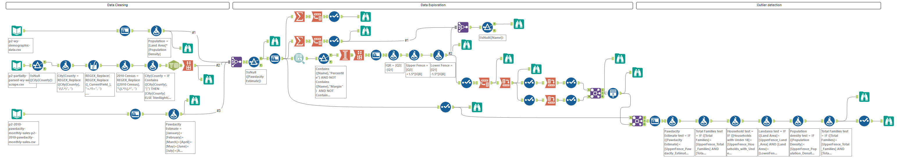
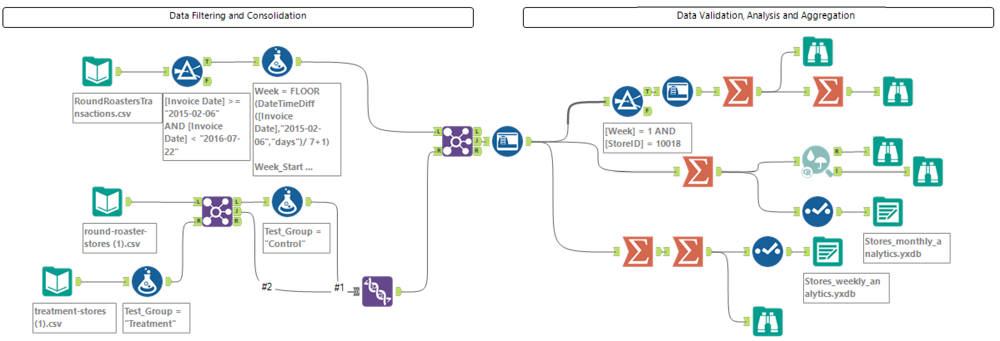
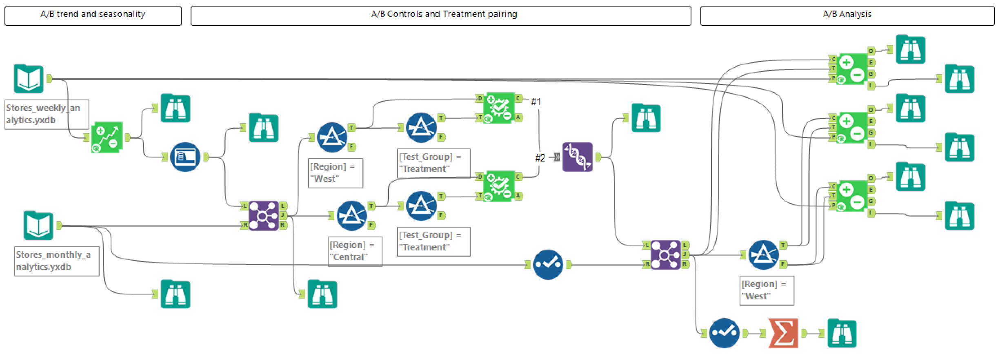
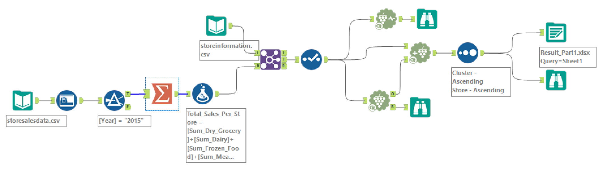
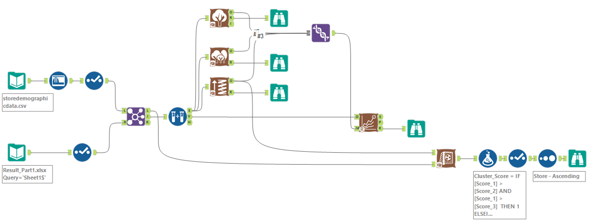
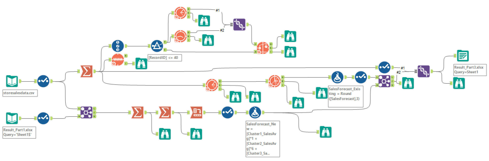

# Portfolio-business-analytics

The [Predictive Analytics for Business](https://www.udacity.com/course/predictive-analytics-for-business-nanodegree--nd008t) Nanodegree program is designed to master a scientific approach to solving problems with data and apply predictive analytics and business intelligence to solve real-world problems. The program projects are done in Alteryx, a tool that prepares, blends, and analyzes data quickly, and Tableau, a powerful data visualization platform.

# CERTIFICATE OF COMPLETITION
  [Click here for checking the Nanodegree certificate](confirm.udacity.com/e/3ac984b2-6128-11ee-a6fe-9be76f9bc811)

## 1. Data Analytics  
Data analysis business contex, analytic frameworks and linear regression for predicting profitability.  
[Check Project Report - Predicting Product Catalogue Profitability](Project1/P1%20-%20Submission_CJ.pdf)

## 2. Data Wrangling  
Data cleaning, extraction and transformation for Interquartile range (IQR) limits and outlier detection for new Shop location.  
[Check Project Report - Data Cleanup and Analytics for new Shop Location](Project2/P2%20-%20Submission_CJ.pdf)

## 3. Classification Models  
Applying and Evaluating different type of Classification models (Logistic and Stepwise regression. Decision trees, Random forest models, Gradient boosting) and using it for Credit Scoring purposes.  
[Check Project Report - Credit Scoring with Classification Models for new Loan Applications](Project3/P3%20-%20Submission_CJ.pdf)

## 4. A/B testing  
Applying A/B testing practices for evaluating a new product variant, if it will improve the performance of the existing product and will make this product more successful, showing a positive treatment effect.  
[Check Project Report - A/B Test for a New Menu Launch](Project4/P4%20-%20Submission_CJ.pdf)  
Data consolidation and analysis part
  
A/B testing part

## 5. Segmentation and Clustering  
Understand the difference between localization, standardization, and segmentation. Select the appropriate number of clusters. Build and apply a k-centroid cluster model and visualize the results.   
[Check Project Report - Segmentation and Clustering for new Store location and Product offering](Project5/P5%20-%20Submission_CJ.pdf)  
K-Centroid Diagnostics and Cluster Analysis part
  
Predictive model comparison and Scoring
    
ETS and ARIMA forecasting
  

## 6. Extra project: Machine learning system for Risk Assessment

This is a Machine Learning Model Scoring and Monitoring project. The problem is to create, deploy, and monitor a risk assessment ML model that will estimate the attrition risk of each of the company's clients. Also setting up processes to re-train, re-deploy, monitor and report on the ML model.
[Check Project Report - Machine learning system for Risk Assessment](Project6_Extra/README.md)  
  

	

  