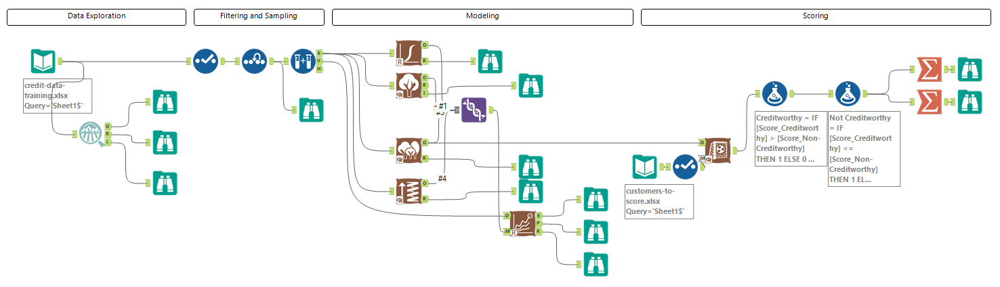
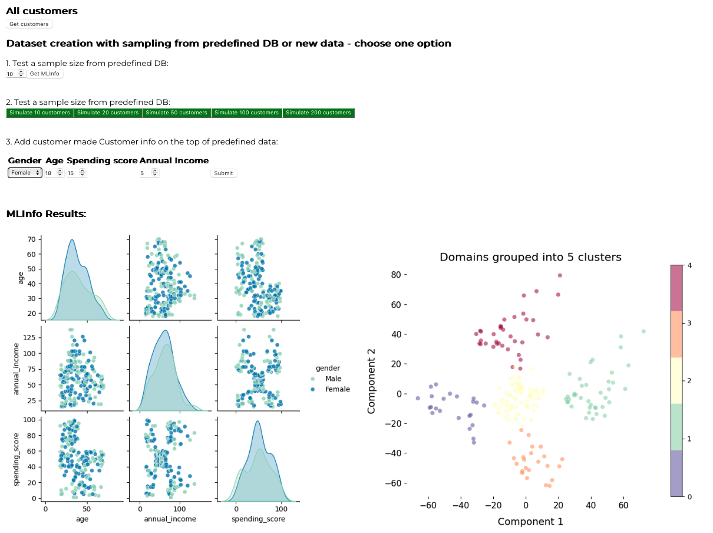

# Portfolio-business-analytics

The [Predictive Analytics for Business](https://www.udacity.com/course/predictive-analytics-for-business-nanodegree--nd008t) Nanodegree program is designed to master a scientific approach to solving problems with data and apply predictive analytics and business intelligence to solve real-world problems. The program projects are done in Alteryx, a tool that prepares, blends, and analyzes data quickly, and Tableau, a powerful data visualization platform.  
As an extracurricular activity, I have also created a Machine Learning pipeline for Dynamic Risk Scoring (with Python, pandas, scikit-learn and matplotlib), where the model continuously re-trained and redeployed, based on newly added data, thus providing continuous monitoring, adaptive scoring and reporting. Details:  
[Check Project - Machine learning system for Risk Assessment](Project6_Extra/README.md) 

# CERTIFICATE OF COMPLETITION
  [Click here for checking the Nanodegree certificate](https://confirm.udacity.com/e/3ac984b2-6128-11ee-a6fe-9be76f9bc811)

## 1. Data Analytics  
Data analysis business contex, analytic frameworks and linear regression for predicting profitability.  
[Check Project Report - Predicting Product Catalogue Profitability](Project1/P1%20-%20Submission_CJ.pdf)

## 2. Data Wrangling  
Data cleaning, extraction and transformation for Interquartile range (IQR) limits and outlier detection for new Shop location.  
[Check Project Report - Data Cleanup and Analytics for new Shop Location](Project2/P2%20-%20Submission_CJ.pdf)

## 3. Classification Models  
Applying and Evaluating different type of Classification models (Logistic and Stepwise regression. Decision trees, Random forest models, Gradient boosting) and using it for Credit Scoring purposes.  
[Check Project Report - Credit Scoring with Classification Models for new Loan Applications](Project3/P3%20-%20Submission_CJ.pdf)

## 4. A/B testing  
Applying A/B testing practices for evaluating a new product variant, if it will improve the performance of the existing product and will make this product more successful, showing a positive treatment effect.  
[Check Project Report - A/B Test for a New Menu Launch](Project4/P4%20-%20Submission_CJ.pdf)  
Data consolidation and analysis part
  
A/B testing part

## 5. Segmentation and Clustering  
Understand the difference between localization, standardization, and segmentation. Select the appropriate number of clusters. Build and apply a k-centroid cluster model and visualize the results.   
[Check Project Report - Segmentation and Clustering for new Store location and Product offering](Project5/P5%20-%20Submission_CJ.pdf)  
K-Centroid Diagnostics and Cluster Analysis part
  
Predictive model comparison and Scoring
    
ETS and ARIMA forecasting
  

## 6. Extra project: Machine learning system for Customer Segmentation

This is a Machine Learning project for Customer Segmentation. The problem is to create, deploy, and monitor a customer segmentation ML model with database integration, API services and React frontend.

You are the owner of a shop. It doesn't matter if you own an e-commerce or a supermarket. It doesn't matter if it is a small shop or a huge company such as Amazon or Netflix, it's better to know your customers.

You were able to collect basic data about your customers holding a membership card such as Customer ID, age, gender, annual income, and spending score. This last one is a score based on customer behavior and purchasing data. There are some new products on the market that you are interested in selling. But you want to target a specific type of clients for each one of the products.

Machine learning comes in handy for this task. Particularly, clustering, the most important unsupervised learning problem, is able to create categories grouping similar individuals. These categories are called clusters. A cluster is a collection of points in a dataset. These points are more similar between them than they are to points belonging to other clusters. Distance-based clustering groups the points into some number of clusters such that distances within the cluster should be small while distances between clusters should be large.

[Check Project - Machine learning system for Customer Segmentation](Project6_Extra/README.md)  
  

	

  